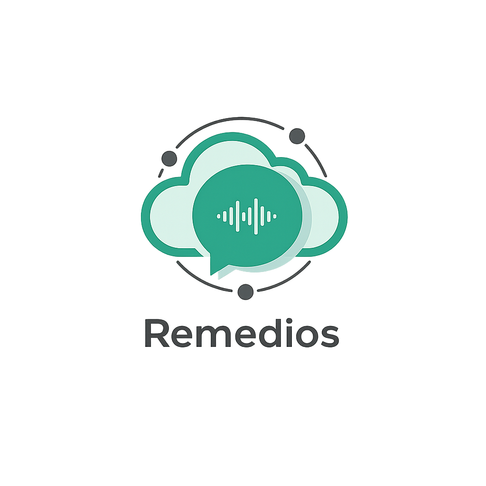

<p align="center">
  
</p>

**Webhook de WhatsApp escalable y ligero para Oracle Cloud Always Free (ARM).**

Remedios despliega una arquitectura de microservicios sobre Kubernetes (k3s) con Kafka, API interna, workers y servicios auxiliares como OpenClaw.

## Requisitos Previos

Todos estos requisitos estan pensados para encajar en la capa Oracle Always Free.

1. Instancia/s Oracle Cloud (Ubuntu 22.04 ARM64)
2. Dominio configurado para el ingress
3. Cuenta y auth key de Tailscale
4. Oracle Autonomous DB + wallet descargado/descomprimido
5. Bucket de Oracle Object Storage
6. Credenciales GHCR si las imagenes no son publicas

## Quick Start

1. Clona el repo y prepara inventario/secretos.
2. Levanta infraestructura del cluster.
3. Despliega servicios con Ansible.
4. Valida pods y logs.

```bash
git clone https://github.com/BorisFaj/remedios.git
cd remedios

ansible-playbook -i zordon/ansible/inventory.ini zordon/ansible/cluster.yml
ansible-playbook -i zordon/ansible/inventory.ini zordon/ansible/services.yml \
  -e "deploy_dispatcher=true deploy_remedios_api=true deploy_remetext=true deploy_whisper_turbo=true"
```

## Clawbot First Use

En el primer uso de Clawbot/OpenClaw hay que hacer onboarding manual dentro del contenedor del pod:

```bash
POD=$(kubectl -n remedios get pod -l app=openclaw -o jsonpath='{.items[0].metadata.name}')
kubectl -n remedios exec -it "$POD" -c openclaw -- openclaw onboard
```

## Documentation

- Guia de deployment (inventario, `.secrets`, playbooks): `docs/deployment.md`
- Guia de OpenClaw (build, UI, token, pairing): `docs/openclaw.md`
- Runbook de operacion y troubleshooting: `docs/runbook.md`
- DB schema reference: `docs/schema.dbml`

## Project Structure

- `remedios/`: codigo de aplicacion (core, consumers, services, commons, tests)
- `zordon/ansible/`: playbooks de cluster y servicios
- `zordon/deploy/`: manifiestos Kubernetes
- `migrations/`: migraciones Alembic
- `scripts/`: utilidades de soporte

## License

MIT.
